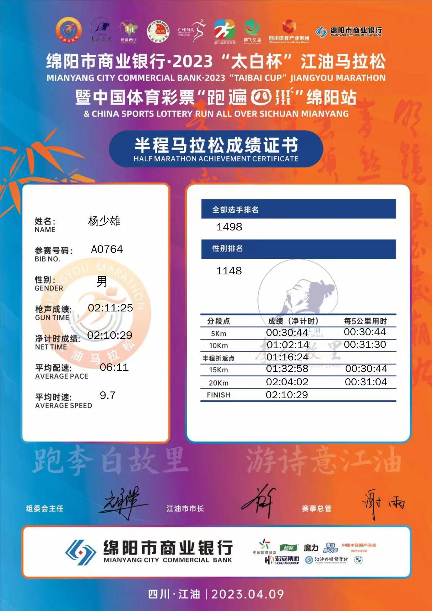
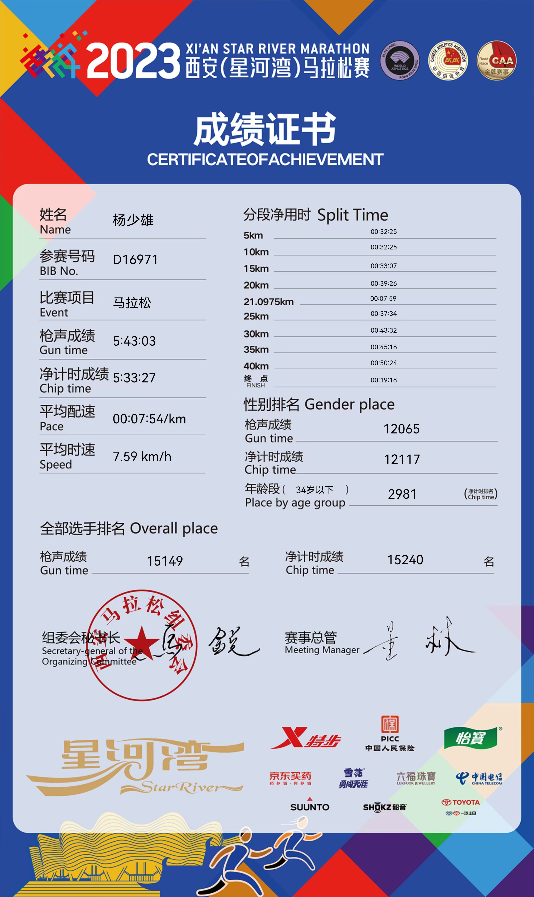
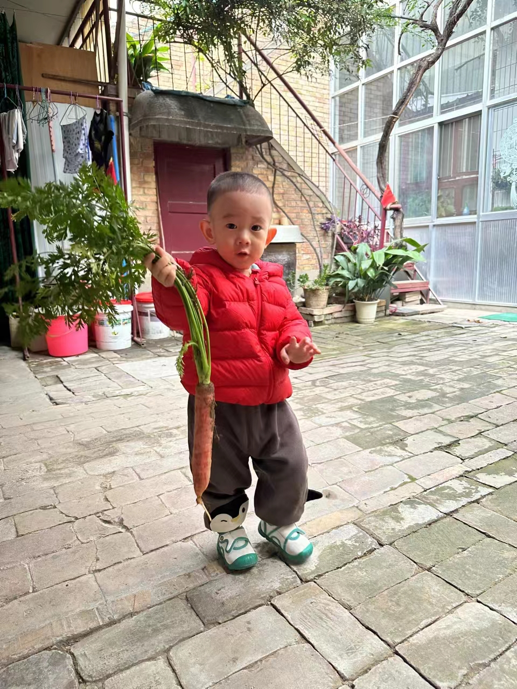
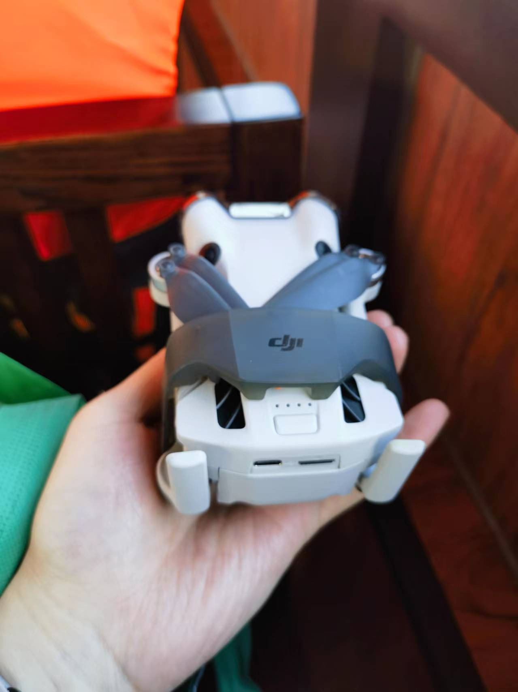
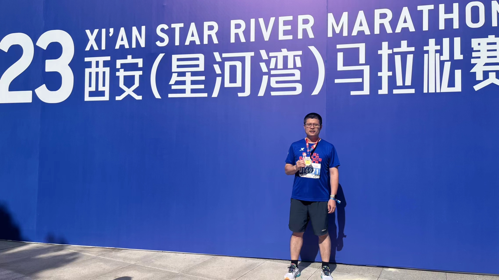
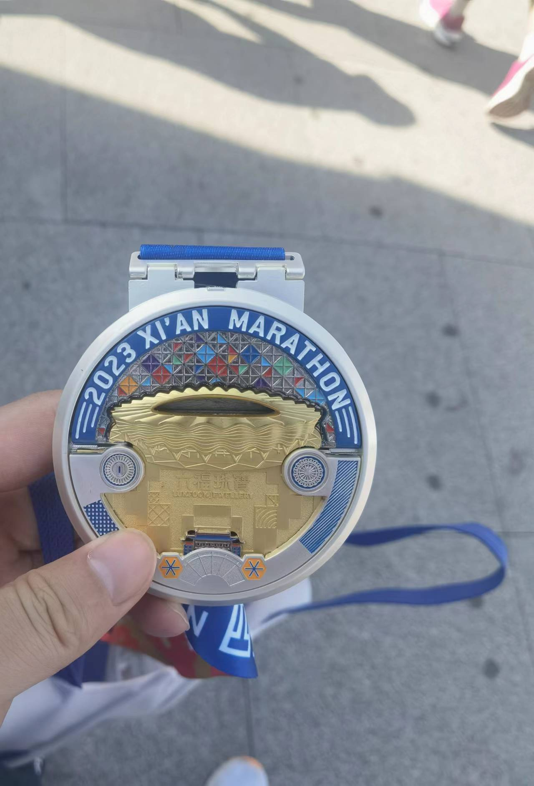
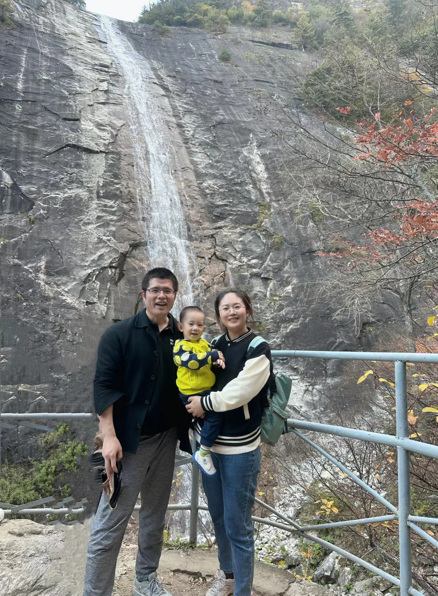
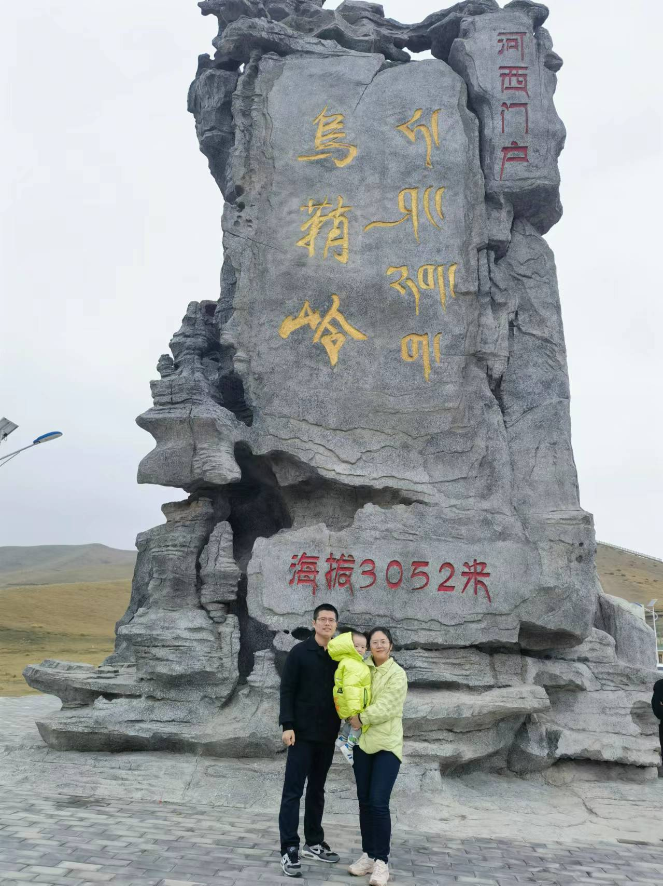
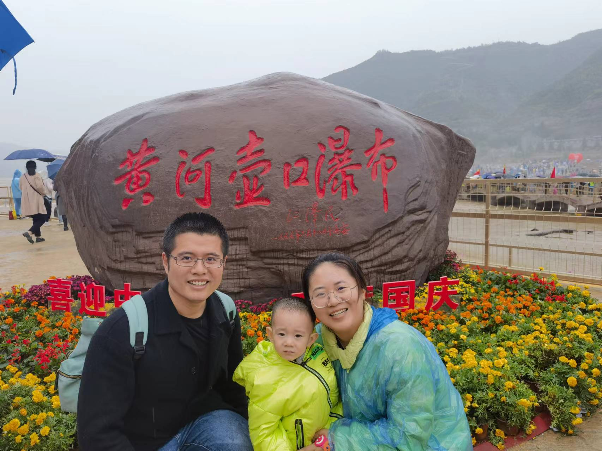
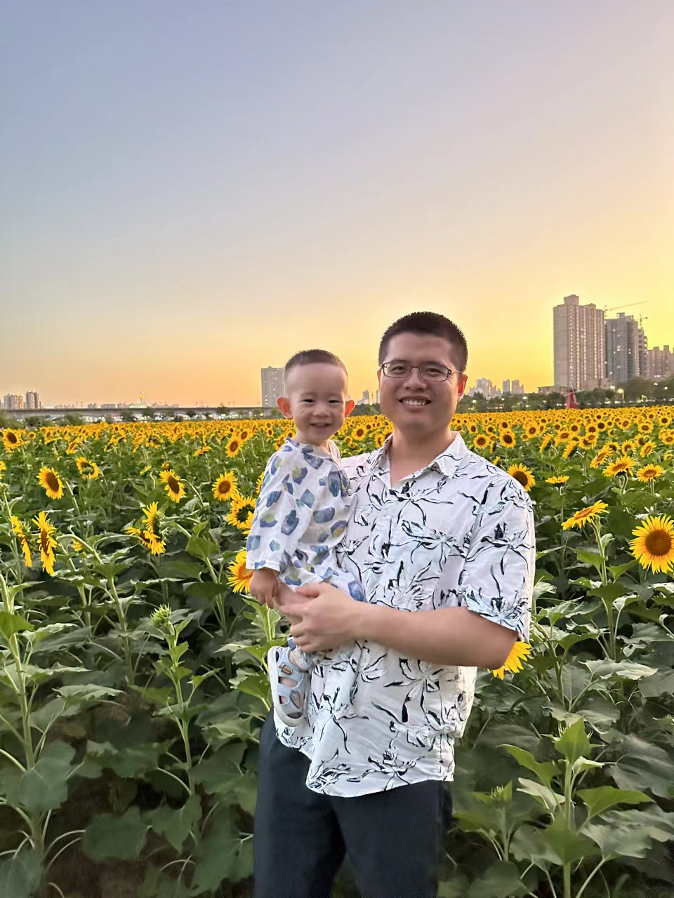

# 2023 年度记忆

## 江油马拉松 4.09

四川江油半程马拉松，全家出动。

## 三门峡 4.30

河南三门峡，看三门峡水利工程。

## 换车 5.13

告别了近8年8w多公里的卡罗拉，换了比亚迪唐dmi，冰川蓝。

## 许巍西安演唱会 6.30

第一次看演唱会，许巍西安演唱会。 曾经的你，我们，蓝莲花，漫步。

## 壶口瀑布 10.02

## 自驾兰州 10.03

10月自驾兰州，一家三口，到达河西走廊起点-乌鞘岭，看到了草原地形。期待下次走完整个河西走廊。

## 西安马拉松 10.29

西安全称马拉松，时隔六年再次跑全马，难度还是很大。

## 游泳 12月

12月报名蛙泳学习课，零基础学习，目前上了6节课，可以戴两块背板蹬蛙泳腿+呼吸，手脚动作还未合一。

## 其他

角色转变：个人贡献者到团队贡献者。

跟踪招聘：入职两个人，还有2个offer未入职。

买了大疆无人机 mini 4pro，现在会入门操作。

秦岭国家植物园，朱雀国家森林公园，太白山唐镇。

**跑步：** 893.37公里，平均配速6分46秒。

**跳绳：** 212708个。

